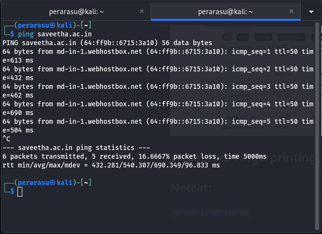
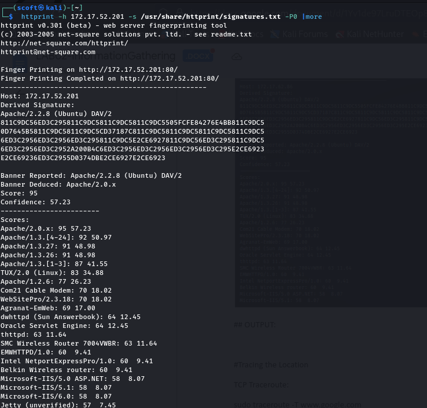

# InformationGathering

Information Gathering Techiques

# To perform information gathering techniques

# AIM:

To perform information gathering techniques using kali linux 

## STEPS:

### Step 1:

Install kali linux either in partition or virtual box or in live mode

### Step 2:

Investigate on the various categories of tools as follows:

### Step 3:

Open terminal/browser and try execute necessary commands/use url to perform information gathering

## Pen Test Tools Categories:

Following Categories of pen test tools are identified for information gathering:

Footprinting is a part of the reconnaissance process which is used for gathering possible information about a target computer system or network.

http://www.whois.com/whois website to get detailed information about a domain name information including its owner, its registrar, date of registration, expiry, name server, owner's contact information, etc.

## OUTPUT:


## Finding IP address:

ping command is available on Windows as well as on Linux OS. Following is the example to find out the IP address of saveetha.ac.in.

```ping saveetha.ac.in```

## output:



## Finding Hosting Company:

get further detail by using ip2location.com website.

## output:


## History of the website:

## Output:


## Webserver Fingerprinting:

## Netcat:

```nc 172.17.52.118 80```

## OUTPUT:


## nmap:

```nmap -p 21 -sV --script=banner ftp.vim.org```

## OUTPUT:


## Whatweb:

```whatweb infosys.com```

```whatweb zoho.com```

```whatweb -v -a 3 172.17.52.201```

## OUTPUT:


## httprint:

```httprint -h 172.17.52.201 -s /usr/share/httprint/signatures.txt -P0 |more```

## OUTPUT:




## Tracing the Location

## TCP Traceroute:

```sudo traceroute -T www.saveetha.ac.in```

## OUTPUT:


## UDP Traceroute:

```sudo traceroute -U www.saveetha.ac.in```

## OUTPUT:


## ICMP Traceroute:

```sudo traceroute  www.saveetha.ac.in```

## OUTPUT:


## RESULT:

The information gathering techniques tools/procedure were  identified successfully